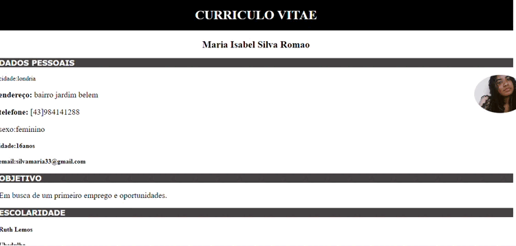

## Curriculo web

Projeto de currículo construído utilizando linguagens:  

HTML5  
CSS3  

Neste trabalho, construímos nosso currículo na disciplina de Lingua Portuguesa e criamos uma versão web nas aulas de Fundamentos de Programação Web.  

Aprendemos no processo a identificar nas soft Skills e Hard Skills.